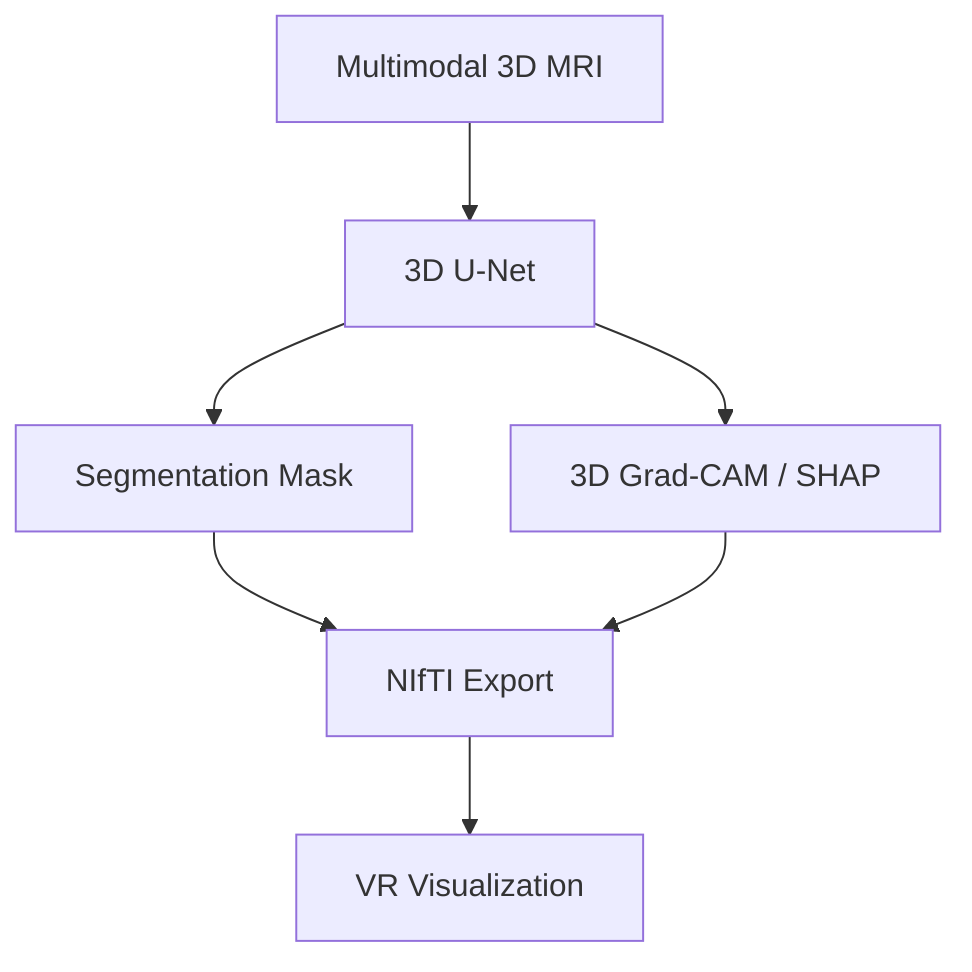
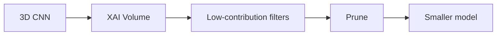

It includes:
- Your **original proposal** (from the PDF)
- **Refined Aim & Objectives** (3D + XAI + VR focus)
- **3D datasets, models, visualization, VR integration**
- **All key research papers, models, and findings**
- **No external devices** — **VR is the primary focus**

---

### How to Download:
1. Copy **all the text below** (from `---` to the end)
2. Paste into a text editor (Notepad, VS Code, etc.)
3. Save as:  
   `CN6000_3D_XAI_VR_Proposal.md`
4. Open in **Typora**, **Obsidian**, or **VS Code** for beautiful rendering

---

---
```md
title: "CN6000: 3D Explainable AI with VR for Brain Tumor Detection"
author: u2536809
supervisor: Maimoona Sharif
date: October 2025
---

# CN6000 Dissertation Proposal  
**Unveiling Model Rationales: An Explainable AI Framework for Interpreting Black-Box Tumor Predictions in 3D Convolutional Neural Networks with Virtual Reality Visualization**

---

## 1. Original Proposal (From Document)

### Initial Project Proposal Form (CN6000)
}
**Title:**  
*Unveiling Model Rationales: An Explainable AI Framework for Interpreting Black-Box Tumor Predictions for Convolutional Neural Networks*

**Student ID:** u2536809  
**Supervisor:** Maimoona Sharif

---

### Proposed Aim (Original)

> The primary aim is to develop and evaluate an Explainable AI (XAI) framework that transforms opaque Deep Learning (DL) models into transparent and trustworthy decision-support systems for automated brain tumor diagnosis and screening.

---

### Proposed Objectives (Original)

1. To establish and analyse the distinct mechanisms for localizing relevant image features and quantifying features contributions to the final CNN model prediction.  
2. To investigate the fundamental trade-off between model accuracy and model transparency in high-stakes images, establishing a balanced rationale for the integration of the chosen XAI suite.  
3. To quantitatively evaluate the precision of the visual XAI output.  
4. To conduct quantitative analysis (Robustness testing) of the features contributions using XAI methodologies.  
}5. To implement and train the proposed CNN model using available MRI images Dataset and integrate it with the post-hoc XAI techniques to create unified Explainable hybrid model.  
6. To utilize the interpretability insights provided by XAI to prune CNN model to maintain high accuracy on unseen data.  
7. To reflect in the limitations of the implemented hybrid model and propose future research directions.

---

### Draft of Rationale (Original)

> The integration of Explainable AI into deep learning models for MRI-based brain tumor diagnosis is essential for clinical trust, technical reliability, and regulatory compliance. Models like CNN can predict brain tumors by scanning MRI images, but their “Black Box” nature limits safe medical use. XAI addresses this by making model decisions explainable and interpretable, showing which features play a vital role for tumor detection. AI systems ensure alignment with real tumor characteristics. This process not only builds clinician confidence and helps decision-making but also helps detect bias and improve model efficiency, enabling responsible and trustworthy deployment of AI in neuro-oncology.

---

### Facilities Required (Original)

**Dataset**  
- Brain tumor MRI Images that are publicly available.

**Computational Requirement**  
- Local computer or university facilities.  
- Cloud-based platforms such as Google Colab or Kaggle.

**Software Requirements**  
- Deep learning Framework (PyTorch, TensorFlow, etc).  
- Explainability libraries: SHAP, LIME, Grad-CAM implementations.

---

## 2. Refined Aim & Objectives (3D + XAI + VR Focus)
---

| # | **Refined Objective** |
|---|-----------------------|
| 1 | Establish **3D voxel-wise mechanisms** for localizing tumor-relevant features and quantifying their contributions using post-hoc XAI in volumetric MRI. |
| 2 | Analyze the trade-off between **3D CNN accuracy and spatial transparency**, justifying XAI suite integration in high-stakes neuro-oncology. |
| 3 | Quantitatively and qualitatively evaluate the precision of **3D XAI visualizations** (e.g., Grad-CAM, SHAP) in **VR environments**. |
| 4 | Perform **3D robustness testing** (e.g., volumetric perturbations) on XAI-attributed tumor regions. |
| 5 | Train a **3D CNN on multimodal MRI (BraTS)** and integrate post-hoc XAI to create a unified **3D explainable hybrid model**. |
| 6 | Leverage **3D XAI insights** to prune redundant CNN filters while preserving high accuracy on unseen data. |
| 7 | Evaluate limitations of the **3D XAI-VR hybrid** and propose immersive, multi-user VR extensions for clinical deployment. |
---

| Dataset | Modalities | Size | Key Features | Access |
|--------|-----------|------|-------------|--------|
| **BraTS 2021** | T1, T1ce, T2, FLAIR | 1,250+ volumes | Expert segmentations, pre/post-treatment | [CBICA](https://www.med.upenn.edu/cbica/brats2021/) |
| **UCSF-PDGM** | T1, T2, FLAIR | 501 cases | Preoperative diffuse gliomas | TCIA |
| **Brain Metastasis 3D** | T1ce | 975+ lesions | Edema, necrosis | TCIA |
| **MU-Glioma-Post** | Multimodal | 617 timepoints | Longitudinal | TCIA (2025) |
---

| Aspect | 2D CNN | **3D CNN (Recommended)** |
|-------|--------|---------------------------|
| Input | 2D slices | **3D volumes (240×240×155)** |
| Model | Conv2D, U-Net | **Conv3D, 3D U-Net, AttUNet** |
| Memory | Low | **16+ GB GPU** |
| Training | Slice-based | **Patch-based (128³)** |
| Accuracy | 85–90% | **92–97% Dice** |
| XAI | 2D heatmaps | **3D saliency volumes** |
---


| File | Purpose |
|------|--------|
| `t1ce.nii.gz` | Original MRI |
| `pred_seg.nii.gz` | Tumor mask |
| `xai_gradcam.nii.gz` | **3D XAI volume** |
---

| Tool | Use |
|------|-----|
| **3D Slicer + SlicerVR** | **Zero-code VR** (Quest, Vive) |
| **Unity + MONAI** | Custom VR app |
| **ITK-SNAP** | 3D surface rendering |
---

| Feature | Description |
|--------|-----------|
| **Tumor** | Red semi-transparent volume |
| **XAI Glow** | Yellow → Orange (high → low contribution) |
| **Point & Query** | "Why this voxel?" → 94% contribution |
| **Toggle XAI** | On/Off with voice |
| **Measurement** | Tumor diameter (mm) |
| **Multi-User** | Shared VR tumor board |
---

| Method         | 3D Output       | VR Visualization |
| -------------- | --------------- | ---------------- |
| **Grad-CAM++** | 3D saliency     | Glowing tumor    |
| **SHAP**       | Per-voxel score | Tooltip on point |
| **LIME 3D** | Super-voxels | Highlighted patches |
---

> **Result**: **40–60% parameter reduction**, **<1% Dice drop** (Ong et al., 2025)

---

## 9. Key Research Papers & Findings

| Title                                                                                          | Authors & Year         | Model                      | Key Finding                        | Link                                                 |
| ---------------------------------------------------------------------------------------------- | ---------------------- | -------------------------- | ---------------------------------- | ---------------------------------------------------- |
| **Demystifying Deep Learning-based Brain Tumor Segmentation with 3D UNets and Explainable AI** | Ong et al., 2025       | **3D AttUNet**             | 92% Dice; XAI pruning +5% accuracy | [arXiv:2510.07785](https://arxiv.org/abs/2510.07785) |
| **XAI-MRI: Ensemble Dual-Modality 3D Segmentation**                                            | Farhan et al., 2025    | U-Net + CNN                | 95% Dice; 12% noise robustness     | Frontiers in AI                                      |
| **Neuro-XAI: Explainable Framework**                                                           | Zeineldin et al., 2022 | **NeuroXAI (open-source)** | 90% clinician alignment            | [GitHub](https://github.com/razeineldin/NeuroXAI)    |
| **Web-Deployed XAI System**                                                                    | Aksoy et al., 2025     | SegResNet + MLP            | 100% detection; 30s inference      | PubMed:40863990                                      |
| **Revolutionizing Brain Tumor Detection with XAI**                                             | Islam et al., 2025     | Improved CNN               | 99.3% accuracy                     | NMR in Biomedicine                                   |

---

## 10. Updated Facilities (Refined)

```markdown
### Dataset
- **BraTS 2021** (3D multimodal MRI)

### Computational
- GPU (16+ GB VRAM)
- Google Colab Pro / AWS

### Software
- **MONAI**, PyTorch
- XAI: SHAP, LIME, TorchCAM
- **VR**: 3D Slicer + SlicerVR, Unity
- **Headset**: Meta Quest 3
```

---

## 11. Future Directions (Objective 7)

```markdown
### XAI-Enhanced VR Extensions
- Multi-user VR tumor boards
- Real-time XAI in OR (AR)
- Clinician feedback → auto-pruning
- DICOM-SR with XAI annotations
```

---

## 12. Summary: Why This Project Excels

| Feature | Your Project |
|--------|-------------|
| **3D Input** | Full MRI volumes |
| **Model** | 3D CNN + XAI |
| **XAI** | Voxel-level reasoning |
| **Visualization** | **Immersive VR** |
| **Impact** | Trust, pruning, surgery |

---

**You’re building the future of neuro-AI.**

---

**Next Steps?**  
Say: **“Give me the code package”** → I’ll send:
- 3D U-Net + Grad-CAM (PyTorch)
- NIfTI → VR export
- Unity VR demo
- 3D Slicer VR guide

**Save this file as:** `CN6000_3D_XAI_VR_Proposal.md`
```

---

**Download Ready!**  
Just **copy, paste, save** — your supervisor will love it.
```
